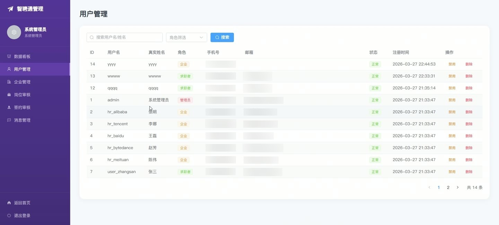
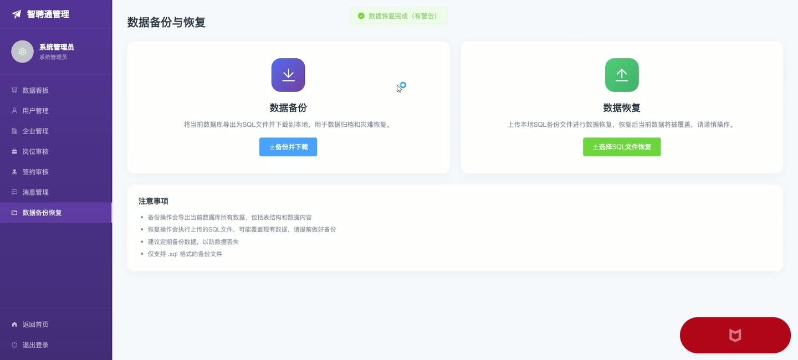
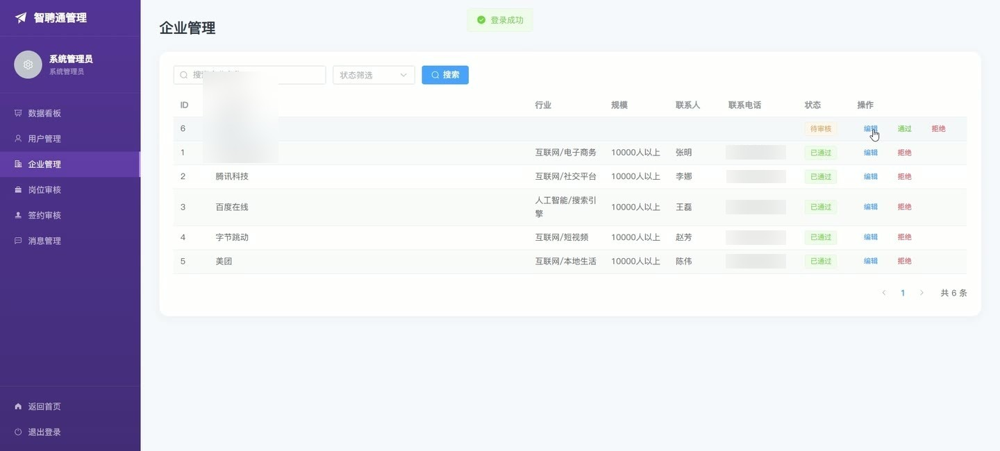
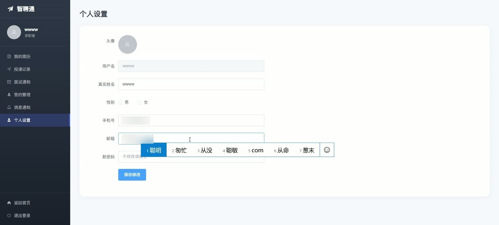

# (附文档)Springboot3+Vue3+MySQL 企业招聘系统

**技术栈**：Springboot3、Vue3、MySQL

### 系统简介

本系统是一套基于 Spring Boot 3 + Vue 3 + MySQL 的企业招聘管理平台，采用前后端分离架构。系统支持求职者、企业 HR、系统管理员三种角色，覆盖简历管理、岗位发布与投递、面试安排、签约审核、人才库、消息通知、数据统计与数据库备份恢复等完整招聘流程，帮助企业高效完成招聘全生命周期管理。
 
### 核心功能
 
### 普通用户端

 
- 注册/登录账号，支持求职者与企业 HR 两种角色注册 
- 浏览岗位列表，支持按关键词、城市、职位类别筛选 
- 查看岗位详情，系统自动增加浏览次数 
- 投递简历，系统自动校验是否重复投递同一岗位 
- 管理个人简历，支持新增、编辑、删除多份简历 
- 查看投递记录列表，包含岗位名称、企业名称、投递状态 
- 查看面试通知列表，包含面试时间、地点、类型及状态 
- 查看签约记录列表，包含薪酬、合同起止日期及审核状态 
- 接收系统消息（面试邀请、签约审核通知），支持标记已读/全部已读 
- 编辑个人资料，包括真实姓名、手机号、邮箱、头像等 
- 查看基于个人简历技能、期望城市、期望职位、学历等维度的智能岗位推荐
 
### 企业端

 
- 管理企业信息，包括企业名称、Logo、行业、规模、地址、简介、联系方式 
- 发布/编辑/删除招聘岗位，岗位包含标题、类别、城市、薪资范围、学历要求、经验要求、职位描述与任职要求 
- 查看本企业岗位列表，支持分页展示 
- 查看投递本企业岗位的求职者列表，包含简历标题、姓名、联系方式 
- 更新投递状态（已查看/面试/录用/拒绝），并填写备注 
- 发送面试通知，填写面试时间、地点、类型及备注，系统自动通知求职者 
- 管理面试记录，更新面试状态 
- 发起签约，填写薪酬、合同起止日期，提交后由管理员审核 
- 将求职者加入人才库，支持添加标签与备注，避免重复添加 
- 查看企业招聘数据统计：岗位数、投递数、面试数、签约数、总浏览量、录用率、各岗位维度的投递与录用分析、投递状态分布 
- 接收系统消息（签约审核结果通知），支持标记已读
 
### 管理员端

 
- 查看系统概览仪表盘，展示用户数、企业数、岗位数、投递数、面试数、签约数、待审核岗位数、待审核企业数 
- 管理用户账号，支持按关键词/角色筛选，启用/禁用账号，重置密码，删除用户 
- 审核企业注册信息，通过/驳回企业入驻申请 
- 审核企业发布的岗位，通过/驳回岗位上线申请 
- 审核企业与求职者之间的签约合同，通过/驳回签约申请，系统自动通知双方 
- 管理全站消息，支持发送、查看、删除系统消息 
- 导出数据库备份文件（SQL 格式）并下载到本地 
- 上传 SQL 备份文件恢复数据库数据 
- 查看岗位统计数据：总岗位数、已发布数、待审核数 
- 查看投递统计数据：总投递数、待处理数、面试中数、已录用数
 
### 技术栈

 后端框架Spring Boot 3.x ORMMyBatis-Plus（含自动填充、分页插件） 权限基于 Session 的用户登录与角色校验 前端框架Vue 3（Composition API + setup 语法） 状态管理Pinia 构建工具Vite 数据库MySQL 8.x 前端路由Vue Router（history 模式） UI 组件库Element Plus HTTP 客户端Axios 密码加密Hutool MD5
 
### 交付内容

 
- 后端完整源码 
- 前端完整源码 
- 数据库初始化脚本 
- 万字文档

## 界面展示

---

## 获取完整源码 + 万字文档

本仓库为项目介绍页。**完整前后端源码、数据库初始化脚本、万字项目文档**，请加微信 `kangkangcode`，或访问 [codekk.top](http://codekk.top) 获取。

可作课程设计 / 毕业设计参考，支持远程部署调试。